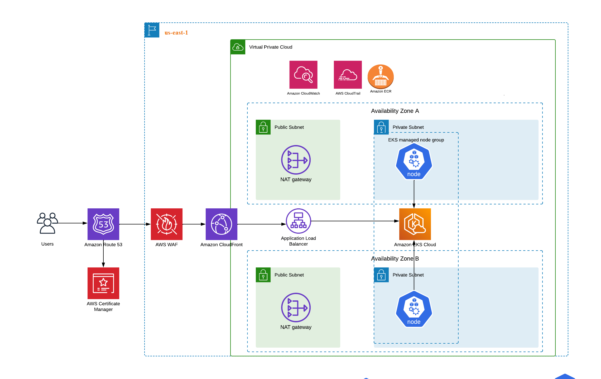

## Kubernetes app-ps-sre single node.


#### Nome da aplicação: app-ps-sre
#### Namespace de trabalho: zgservicos

## Requisitos atuais do servidor

CPU:  2

Memória:  8 GB

Logando no servidor:

```
 ssh -i suachaveprivada debian@$IPdoServidor

```

## Analisando os logs do pods independente no nome

```
kubectl logs -f $(kubectl get pods -n zgservicos |awk '{print $1}' |grep -i app) -n zgservicos
```

## Monitorando todos os pods de todos os namespaces

```
watch "kubectl top pods --all-namespaces"

```

## Monitorando o CPU e memória do node Via CLI

```
watch "kubectl top nodes"

```


## Investigação e testes

1. Pod não estava disponível a aplicação estava com erro Bad Gateway 502
2. Foi removido o request e limit do resource do deployment a aplicação se estabiliazar e usar kubeclt top para encontrar o consumo.
3. Foi removido o livenessProbe e readinessProbe porque o healthcheck não estava encontrando o endoint de health.
4. Problemas no PostgreSQL : FATAL: sorry, too many clients already alteração no postgresql.conf 

max_connections = 100                   # (change requires restart)

```
$ sed -i 's/max_connections = 100/max_connections = 900/' /etc/postgresql/13/main/postgresql.conf
$ /etc/init.d/postgresql restart

```


## Instalando ferramentas de monitoramento
Configurar no servidor para usar o helm:

```
export KUBECONFIG=/etc/rancher/k3s/k3s.yaml
```

# Instalar grafana via Helm chart e salvar o values localmente para alterações futuras:

```
helm repo add grafana https://grafana.github.io/helm-charts
helm repo update
helm show values grafana/grafana > values.yaml
helm install grafana grafana/grafana --version 8.5.1
helm upgrade grafana grafana/grafana -f values.yaml

```


# Instalar o prometheus e salvar os values localmente no servidor

```
helm repo add prometheus-community https://prometheus-community.github.io/helm-charts
helm repo update
helm install prometheus prometheus-community/prometheus

helm show values prometheus-community/prometheus > values-prometheus.yaml
helm upgrade prometheus prometheus-community/prometheus  -f values.yaml

```

# Instalar o PostgreSQL exporter no servidor e monitorar o banco de dados

```
helm repo add prometheus-community https://prometheus-community.github.io/helm-charts
helm repo update
helm install pg-exporter prometheus-community/prometheus-postgres-exporter
helm show values prometheus-community/prometheus-postgres-exporter > values-prometheus.yaml
helm upgrade pg-exporter prometheus-community/prometheus-postgres-exporter  -f values-prometheus.yam

```
## Configuração de exemplo do exporter

```
helm upgrade pg-exporter prometheus-community/prometheus-postgres-exporter --namespace default \
--set postgres.host=8.8.8.8 \
--set postgres.port=5432 \
--set postgres.user=usuario \
--set postgres.password=sennha

kubeclt edit configmap prometheus-server
kubectl rollout restart deployment  prometheus-server -n default
```

## Configurando o AutoScalling da aplicação
Para habilitar enable: true
```
cd app/chart
values.yaml

autoscaling:
  enabled: false
  minReplicas: 1
  maxReplicas: 2
  #targetCPUUtilizationPercentage: 80
  #targetMemoryUtilizationPercentage: 80

```


## Arquitetura atual do app-ps-sre Kubernetes

* Número de replicas do deployment:  app-ps-sre 1
* Aplicação não possui HPA
* Banco de dados postgreSQL com ip público e porta aberta para o mundo.


## Sugestão de melhoria de arquitetura utilizando AWS.


